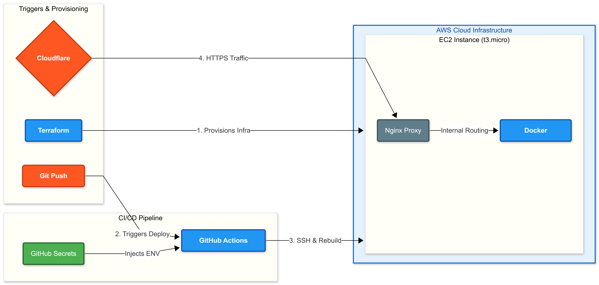
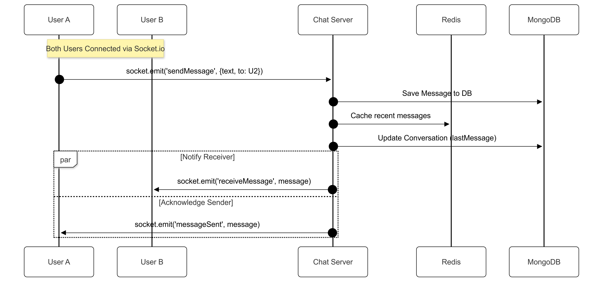

— CLOUD INFRASTRUCTURE & DEVOPS ENGINEERING —
Architected and deployed a containerized microservices infrastructure for a Strava-style platform on AWS EC2 using Terraform for Infrastructure as Code (IaC). I focused on building a scalable, production-ready environment to host multiple Express services and a Next.js frontend within a unified Docker network.

The core of my work involved engineering a high-performance Nginx Reverse Proxy to manage REST APIs and real-time Socket.io traffic with SSL/TLS encryption. I optimized the communication layer using Redis for low-latency message caching and designed the system for high-concurrency scaling.

The entire infrastructure is automated through a GitHub Actions CI/CD pipeline, achieving a zero-touch deployment cycle with persistent MongoDB storage and Cloudflare DNS management.

## 1. System Overview & Tech Stack
The platform follows a microservices-inspired pattern, separating concerns between the core API, real-time messaging, and the frontend client.

* **Frontend:** Next.js (React), TailwindCSS
* **Backend:** Node.js, Express, Socket.io
* **Database:** MongoDB (Persistent Data), Redis (Caching & Pub/Sub)
* **Gateway:** Nginx

## 2. System Architecture
The application runs inside a secure **Docker Internal Network** on an AWS t3.micro instance. Nginx acts as the single entry point, terminating SSL and routing traffic to the appropriate container based on the path (e.g., `/api` to Main Server, `/socket.io` to Chat Server).

## 3. Infrastructure & Deployment (CI/CD)
The entire infrastructure lifecycle is automated. **Terraform** provisions the AWS resources (EC2, Security Groups, Elastic IP), while **GitHub Actions** handles the continuous deployment.

* **Zero-touch Deployment:** Pushing to `main` automatically triggers the pipeline.
* **Automation:** The workflow SSHs into the EC2 instance, pulls the latest images, and rebuilds containers without downtime.

## 4. Database Schema (ERD)
Data persistence is managed by **MongoDB** with Mongoose ODM. The schema is designed to handle relational data (users, activities, comments) efficiently in a NoSQL environment.

## 5. Workflows & Real-time Communication

### 5.1 Authentication Flow (JWT)
Standard, secure authentication flow using JSON Web Tokens (JWT) stored in LocalStorage.

### 5.2 Real-time Chat Flow
To ensure high concurrency and low latency, the chat service utilizes **Redis** for message caching and **Socket.io** for bi-directional communication.

## 6. API Reference Map
A high-level view of the RESTful endpoints exposed by the microservices, unified under the Nginx gateway.

